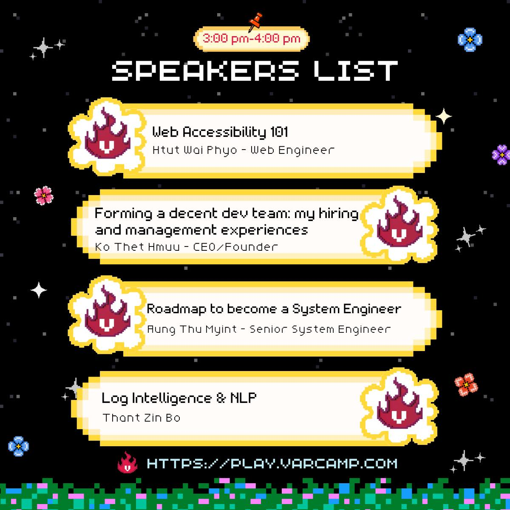

# Web Accessibility 101

## 💭 Philosophy

> "The web is accessible by default; we just messed it up."

Let's fix it by exploring physical & digital accessibility and why it matters to build inclusive web experiences that work for everyone, including people with disabilities.

## 📋 Overview

This is the foundational speaker session that introduces the core concepts of web accessibility. This presentation serves as the theoretical foundation for the hands-on Web Accessibility 102 workshop.

**Session Details:**

- 🏆 **Event:** VarCamp 2025  

## 🎯 Key Topics Covered

This introductory session explores:

- **Physical vs Digital Accessibility** - Understanding different types of accessibility needs
- **Why Accessibility Matters** - The business case and human impact  
- **Common Barriers** - How we accidentally make the web inaccessible
- **Foundation Principles** - POUR (Perceivable, Operable, Understandable, Robust)
- **Getting Started** - Simple steps to begin accessibility implementation

## 🎯 Learning Outcomes

After this session, participants will:

- ✅ Understand what web accessibility means and why it's crucial
- ✅ Recognize common accessibility barriers in digital products  
- ✅ Know the fundamental principles of accessible design
- ✅ Be motivated to implement accessibility in their work
- ✅ Have foundation knowledge for hands-on implementation (Web Accessibility 102)

## 🔗 Session Materials

- 📊 **Presentation Slides:** [View on Canva](https://www.canva.com/design/DAGw_lYS8wM/2CD0DLzwNcloNXrOLe4wQQ/edit?utm_content=DAGw_lYS8wM&utm_campaign=designshare&utm_medium=link2&utm_source=sharebutton)
- 🛠️ **Follow-up Workshop:** [Web Accessibility 102](../web-accessibility-102/) - Hands-on implementation

## 🌐 Why This Matters

Web accessibility isn't just about compliance—it's about:

- **Inclusion** - Making the web work for everyone
- **Business Growth** - Reaching a broader audience (15% of the global population)
- **Legal Compliance** - Meeting accessibility standards and regulations
- **Better UX** - Accessible design benefits all users
- **Technical Excellence** - Writing better, more semantic code

## 📚 Recommended Follow-up Resources

- 📖 **WCAG Guidelines:** [Web Content Accessibility Guidelines 2.1](https://www.w3.org/WAI/WCAG21/quickref/)
- 🛠️ **Testing Tools:** [aXe DevTools](https://www.deque.com/axe/devtools/)
- 📱 **Screen Reader Testing:** Try VoiceOver (macOS) or NVDA (Windows)

*Accessibility Needs All of Us. Be A Part of Community* ♿
