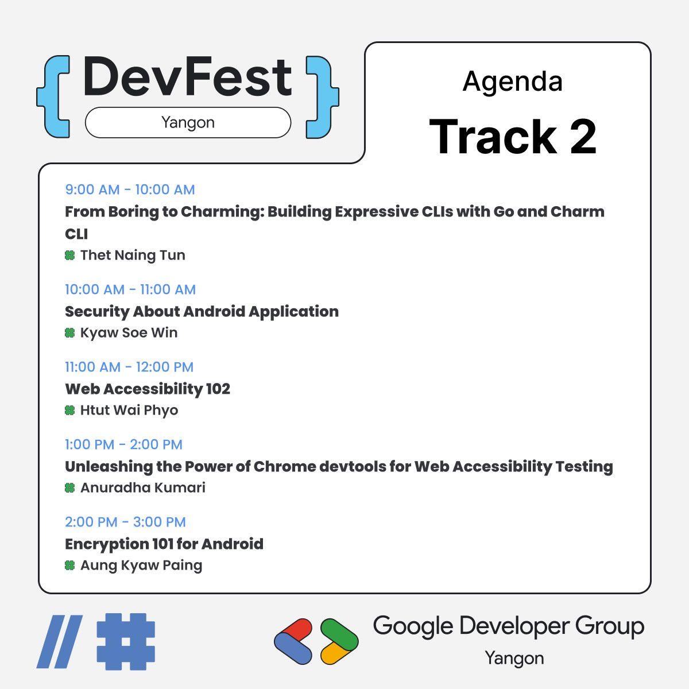

# Web Accessibility 102

## 📋 Overview

This session is a follow-up practical workshop for Web Accessibility 101 presented at DevFest Online by Google Developer Group Yangon. The session focuses on implementing accessibility best practices through hands-on coding examples.

**Session Details:**

- 📅 **Date:** November 22, 2025
- 🎯 **Event:** DevFest Yangon 2025
- 👥 **Organizer:** Google Developer Group Yangon

## 🎯 Learning Objectives

After completing this session, participants will understand how to implement:

- Color contrast, Animation, Layout
- Proper alt text for images
- Semantic HTML elements for better accessibility
- Form labels and accessibility patterns
- ARIA attributes and their usage

## 📁 Session Content

This repository contains practical examples demonstrating common accessibility patterns:

### Examples Included

| File | Topic | Description |
|------|-------|-------------|
| [`alt-text.html`](./alt-text.html) | **Image Accessibility** | Demonstrates proper and improper alt text usage for images |
| [`semantic.html`](./semantic.html) | **Semantic HTML** | Shows the difference between semantic elements and generic divs |
| [`label.html`](./label.html) | **Form Labels** | Examples of proper form labeling techniques |

## 🚀 Getting Started

1. **Clone or download** this repository
2. **Open the HTML files** in your web browser
3. **Test with screen readers** to experience the accessibility differences
4. **Modify the examples** to practice implementation

## 📚 Resources

- 📊 **Presentation Slides:** [View Slides](https://docs.google.com/presentation/d/17-f2YDJfwmP3GKqPMKQSRfgdzNrh_wvsG6PnQ-Tz8BA/edit?usp=sharing)

### Google Developer Group Yangon

- 🌐 [GDG Yangon Community](https://gdg.community.dev/gdg-yangon/)
- 💬 Join our community discussions

*Making the web accessible for everyone, one element at a time.*
